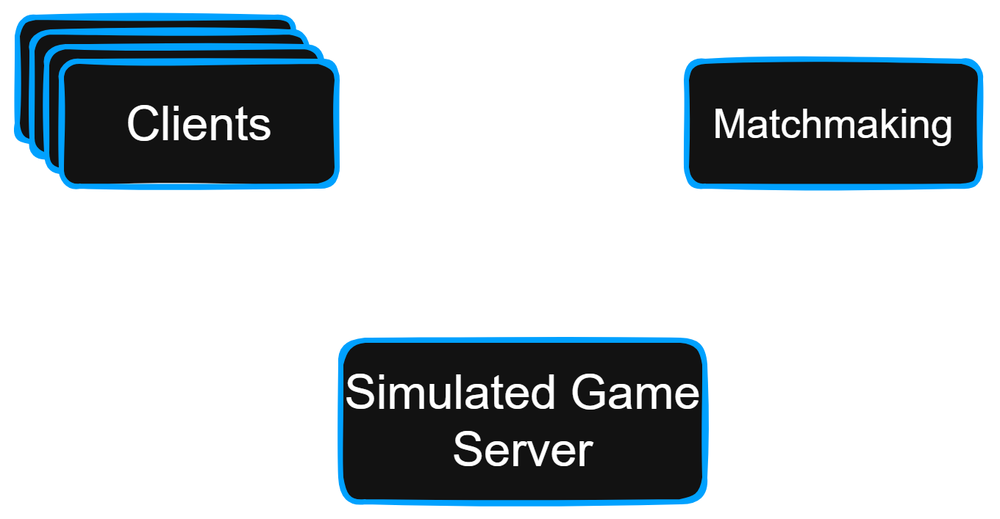
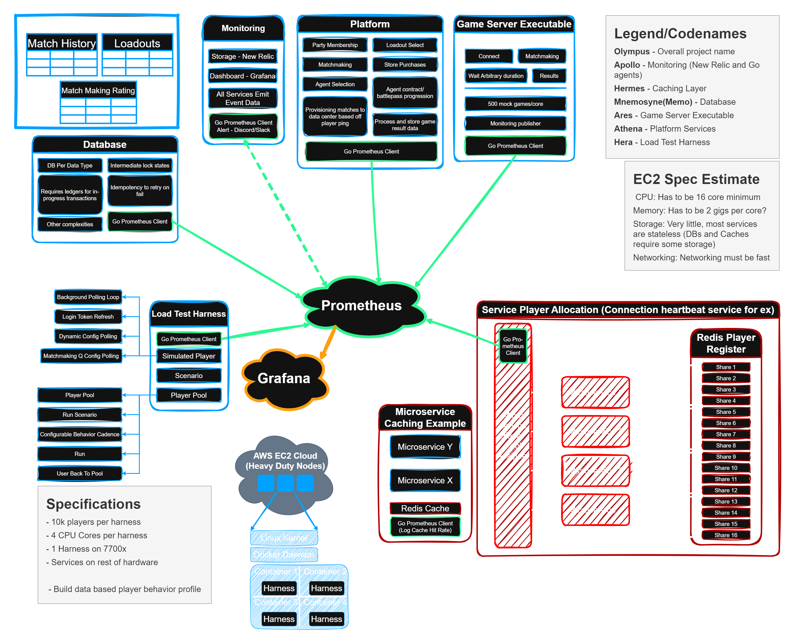

# Overview
This is an insanely skunkworks type project. Everything here is experimental and most likely unstable.
Will use this as the base for my Olympus project.

The project is made up of multiple services that culminate in a platform that services to simulate the network load test performed by Riot Games before they deployed Valorant. More information on that can be found at [Scalability and Load Testing for VALORANT](https://technology.riotgames.com/news/scalability-and-load-testing-valorant). 

The following is a short breakdown of what each services purpose is: 

# Matchmaking Service
The matchmaking service will mimic a stripped down version of the League of Legends match maker. It will listen to connections that come in from player clients, once enough players have connected it will match them up based off of a primitive "Anchor Being" methodology. Nine players plus the originating player will form the 10 man lobby and the team player names will be sent back to the participating players.

# Simulated Game Executable Service
This service serves to simulate the Game Server Executable that is what is deployed in the Riot Games Valorant load test where once the players are matched they can play the game. This executable is what manages the actual in game functions. Since this is a load test platform that serves to simulate the actual network It would not help if this was the bottleneck and if a large amount of development time was eaten up. Rather than a REAL game server executable, this service simulates the behavior, manages the connections for the conneceted players, and produces randomized match results.



## Player Selection Method - "Anchor Being"
At the moment there is no complicated matching algorithm in place being used to match players. Each player will search for their own set of team mates, essentially treating themselves as the anchor. Once they are finishes combing through the Redis database for matching possible teammates we notify all selected parties that they have been selected and send them whatever we need to.

## Deploy
There is a dockerized build of the application. The main `Dockerfile` is used for building the GO server itself and it is triggered from the docker-compose file. The docker-compose file will deploy the Redis database as well as the GO matchmaking server. 

To deploy the matchmaking service just run the following command in the projects root directory
```bash
docker-compose up
```
> **Note:** You might have to run `docker-compose up --build` if you have having problems with old builds being cached. 

> **Note:** You might also run into an error related to docker having some artifacts from a pervious build if you make any changes to the code so running `docker-compose down --volumes` before the next `docker-compose up --build` can help.

# High Level Design Diagram
This is a high level design diagram detailing a some requirements for specific conponents of the overall architecture. Some things are still being determined so this is a work in progress.




# Project Styling Guidelines

## IN THIS HOUSE WE USE TABS NOT SPACES

## Naming conventions

- Each service will have a main directory under the top level of the repo in snake case naming
- File names are in camel case
- Function and varialbe names will adhere to Camel Case unless this clashes with GO and its use of Pascal Case
- Variables intended to be constants will be in something like all UPPER CASE

## Project Structur
The basic structure is of creating services will look like the following:
```
.
└── Olympus/
    ├── game_server_service
    ├── platform_service
    ├── matchmaking_service/
    │   ├── {serviceName}Proto/
    │   │   ├── {serviceName}.pb.go
    │   │   └── {serviceName}.proto
    │   ├── main.go
    │   └── Other required service files...
    ├── dbScripts/
    │   └── init.sql
    ├── .gitignore
    ├── docker-compose.yaml
    ├── prometheus.yml
    ├── LICENSE
    └── README.md
```


# Personal Notes

Personal scratchpad for random facts, links, notes, or points of note.

## Generate New Proto Scheme
To generate a new protobuf scheme you can use the followign command after editing the .proto file of your choice

```bash
protoc --go_out=. --go_opt=paths=source_relative party.proto
```